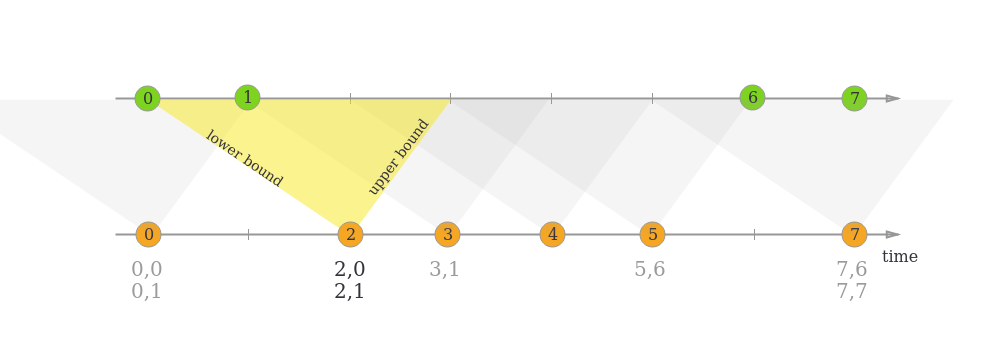

**Window Join**\
A window join joins the elements of two streams that share a common key and lie in the same window.\
stream.join(otherStream)\
  .where(<KeySelector>)\
  .equalTo(<KeySelector>)\
  .window(<WindowAssigner>)\
  .apply(<JoinFunction>);

---
**Tumbling Window Join**\
When performing a tumbling window join, all elements with a common key and a common tumbling window are joined as pairwise \
combinations and passed on to a JoinFunction or FlatJoinFunction. That means, that all combinations of elements from those streams are\
created for every window. If we have 2 streams, whic hhave both in that window element 0 and 1, it emits combinations of :
0-0, 0-1, 1-0, 1-1
---
**Sliding Window Join**\
Same as tumblings, but sliding :D Also every pairwise combination created.
---
**Session Window Join**\
When performing a session window join, all elements with the same key that when “combined” fulfill the session criteria are joined in \
pairwise combinations and passed on to the JoinFunction or FlatJoinFunction. Again this performs an inner join, so if there is a \
session window that only contains elements from one stream, no output will be emitted!
---
**Interval Join**\
The interval join joins elements of two streams (we’ll call them A & B for now) with a common key and where elements of stream B have \
timestamps that lie in a relative time interval to timestamps of elements in stream A.\
This can also be expressed more formally as:\
b.timestamp ∈ [a.timestamp + lowerBound; a.timestamp + upperBound] or a.timestamp + lowerBound <= b.timestamp <= a.timestamp + upperBound

In the example above, we join two streams ‘orange’ and ‘green’ with a lower bound of -2 milliseconds and an upper bound of +1 millisecond. \
Be default, these boundaries are inclusive, but .lowerBoundExclusive() and .upperBoundExclusive() can be applied to change the behaviour.

The timers allow applications to react to changes in processing time and in event time. Every call to the function processElement(...) \
gets a Context object which gives access to the element’s event time timestamp, and to the TimerService. The TimerService can be used \
to register callbacks for future event-/processing-time instants. With event-time timers, the onTimer(...) method is called when the \
current watermark is advanced up to or beyond the timestamp of the timer, while with processing-time timers, onTimer(...) is called when \
wall clock time reaches the specified time. During that call, all states are again scoped to the key with which the timer was created, \
allowing timers to manipulate keyed state.

---

**Low-level Joins**\
To realize low-level operations on two inputs, applications can use CoProcessFunction or KeyedCoProcessFunction.\
This function is bound to two different inputs and gets individual calls to processElement1(...) and processElement2(...)\
For example, you might be joining customer data to financial trades, while keeping state for the customer data.\
If you care about having complete and deterministic joins in the face of out-of-order events, you can use a timer to \
evaluate and emit the join for a trade when the watermark for the customer data stream has passed the time of that trade.

---

**Timers**\
Both types of timers (processing-time and event-time) are internally maintained by the TimerService and enqueued for execution.\
The TimerService deduplicates timers per key and timestamp, i.e., there is at most one timer per key and timestamp. If multiple \
timers are registered for the same timestamp, the onTimer() method will be called just once, because Flink manages only 1 Timer per key and timestamp.\
Flink synchronizes invocations of onTimer() and processElement(). Hence, users do not have to worry about concurrent modification of state.

Timers are fault tolerant and checkpointed along with the state of the application. In case of a failure recovery or when starting \
an application from a savepoint, the timers are restored.

**Timer Coalescing**\
Since Flink maintains only one timer per key and timestamp, you can reduce the number of timers by reducing the timer resolution to coalesce them.\
For a timer resolution of 1 second (event or processing time), you can round down the target time to full seconds. Timers will fire at most 1\
second earlier but not later than requested with millisecond accuracy. As a result, there are at most one timer per key and second.\

